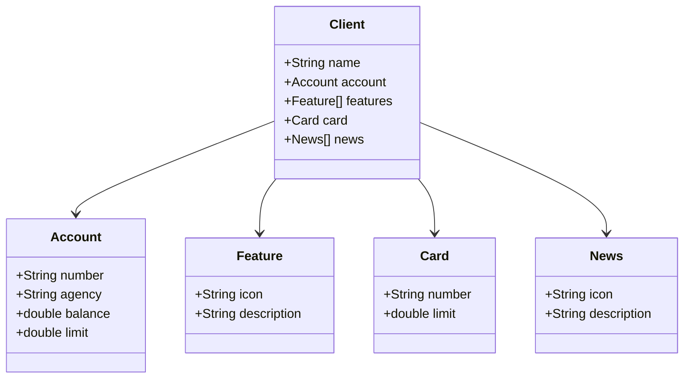

# Estruturando objetos json

```
{
  "name": "Venilton", 
  "account":{
    "number": "00000000-0", 
  "agency": "0000", 
  "balance": 1324.64, 
  "limit": 1000.00 
  },
  "features":[
    {
      "icon":"",
      "description":"PIX"
    }
  ],
  "card":{
    "number": "xxxx xxxx xxxx 0000", 
    "limit": 1000.00
  },
  "news":[
    {
      "icon": "URL",
      "description": "O Santander tem soluções de crédito sob medida pra você." 
    }
  ]


}

```

<a href="https://jsoneditoronline.org">Json Editor Online</a>


# Usando ChatGpt para gera diagrama de classes

